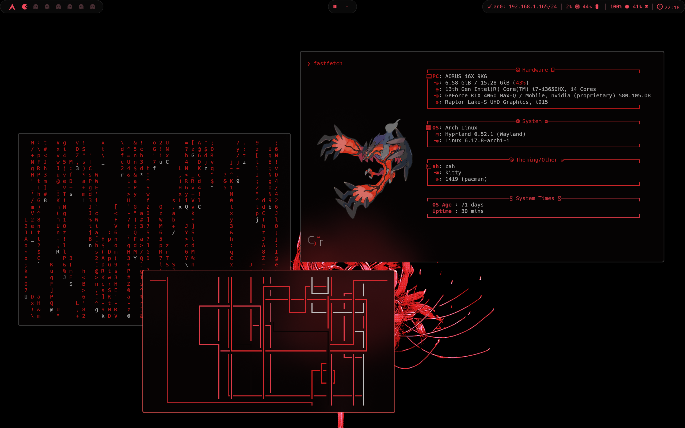
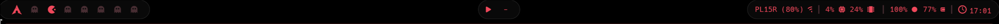
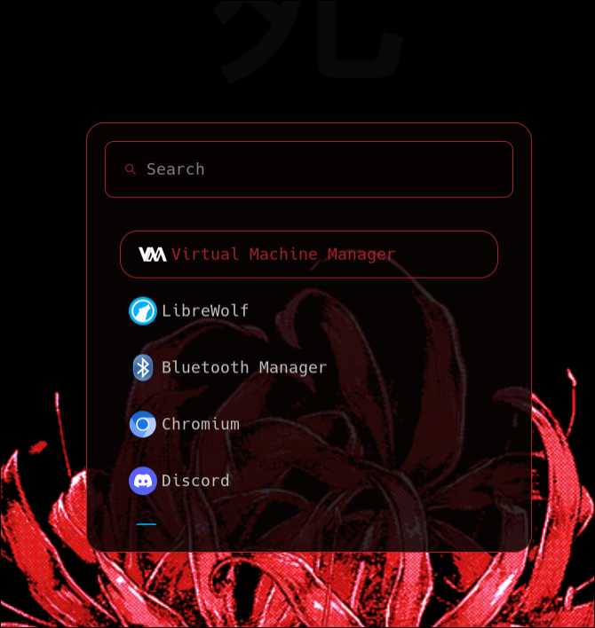
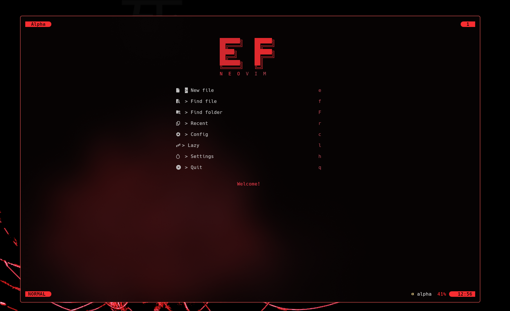
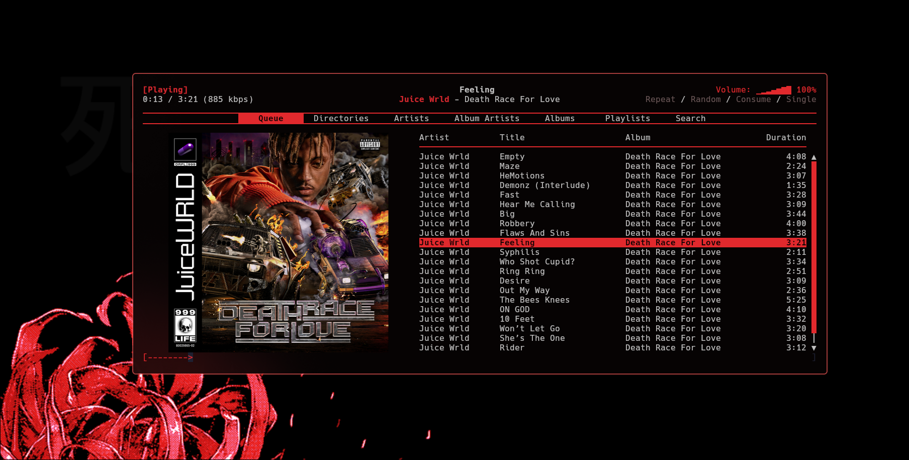
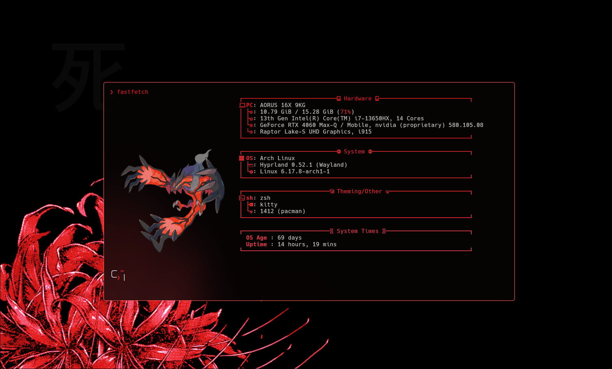

# 🜁 Dotfiles de Hyprland en Arch Linux

Bienvenido a mis **dotfiles personales** para **Hyprland** en **Arch Linux (btw)**.  
Este repositorio contiene toda mi configuración, incluyendo WM, terminal, barra, notificaciones, theming y más.

---

## 🖥️ Sistema

- **SO:** Arch Linux
- **Fuente:** Hack Nerd Font
- **Shell:** Zsh
- **Display Manager:** SDDM (con _Silent SDDM_)

---

## 🪟 Hyprland — Window Manager

Incluye:

- `hypridle`    
- `hyprlock`
- `hyprpaper`
- `hyprshot`

---

## 📊 Waybar — Barra de tareas

Capturas:

---

## 🚀 Wofi — App Launcher (Wayland)

---

## 🧪 Kitty — Terminal GPU-based

- **oh-my-zsh**
    - Plugins:
        - `zsh-autosuggestions`
        - `zsh-syntax-highlighting`
        - `fast-syntax-highlighting`
        - `zsh-autocomplete`
        - `sudo`
- **p10k** (powerlevel10k)
- **bat** (batcat)
- **lsd** (ls)

---

## 🎨 PyWal — Theme Generator

---

## 🌐 Navegador

- **Zen Browser**    

---

## ✍️ NeoVim — Editor de texto

---

## 🎧 rmpc — Cliente de terminal MPD

---

## ⚙️ fastfetch — System Info (CLI)

---

## 🔔 swaync — Notification Daemon

https://github.com/user-attachments/assets/dfefb452-cebd-4506-a88a-886918de5c8c

---

## 🔒 wlogout — Logout Manager (GUI)

https://github.com/user-attachments/assets/ca72dbe4-a727-499b-806e-769ffc41f907

---

## 🖥️ SDDM — Display Manager

https://github.com/user-attachments/assets/ff545e8b-61e7-43c6-9821-cf6ec7f6d891
